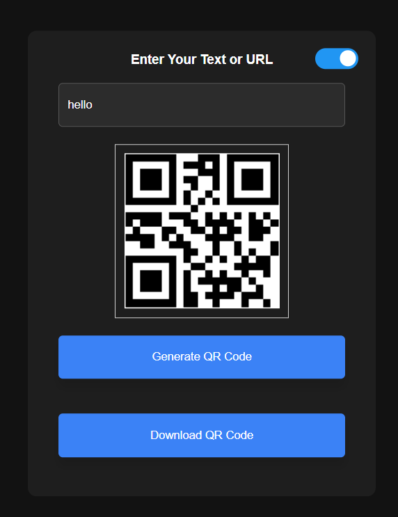

# 📱 QR Code Generator Web App

A simple and responsive **QR Code Generator** built using HTML, CSS, and JavaScript.  
Users can instantly generate QR codes from any text or URL, download them, and even switch between light and dark mode.

---

## 🔗 Live Demo

👉 https://qr-code-generator-eta-flame.vercel.app/

---

## 🚀 Features

- 🔤 Generate QR codes from text or URLs
- ⚡ Instant preview after input
- 📥 Download QR code as PNG
- 🧹 Auto-clear when input is empty
- 🌙 Dark mode toggle for better UX
- 💡 Clean and minimal UI

---

## 🛠️ Tech Stack

- **HTML** – Structure
- **CSS** – Styling & Dark Mode
- **JavaScript** – Functionality & API integration
- **QR Code API** – https://api.qrserver.com

---

## 📂 Project Structure
``` bash
📁 qr-code-generator
├── index.html
├── style.css
├── script.js
└── README.md
```
---

## ⚙️ How It Works

1. User enters text or URL  
2. JavaScript encodes the input  
3. QR Code API generates the image  
4. Image loads dynamically on the page  
5. User can download the QR code  

---

## 🧠 Key Concepts Used

- DOM Manipulation  
- Event Handling (`click`, `input`, `change`)  
- API Integration  
- Dynamic Image Loading (`onload`)  
- File Download using `<a>` tag  
- Dark Mode using CSS class toggle  

---

## 📸 Preview
### 🌙 QR Generator dark 


### ⚡ QR Generator light


---

## 📥 Installation & Usage

1. Clone the repository:
git clone https://github.com/bs-bhaskar/qr-code-generator.git

2. Open the project folder:

3. Run the project:

Open `index.html` in your browser

---

## 📌 Future Improvements

- 🎨 Custom QR color & size  
- 🖼️ Add logo inside QR code  
- 📱 Better mobile responsiveness  
- 📊 History of generated QR codes  

---

## 🤝 Contributing

Pull requests are welcome. For major changes, open an issue first to discuss.

---

## 📜 License

This project is open-source and available under the MIT License.

---

## 💬 Author

Made with ❤️ by **Bhaskar**

---

⭐ If you found this project helpful, don’t forget to star the repo!